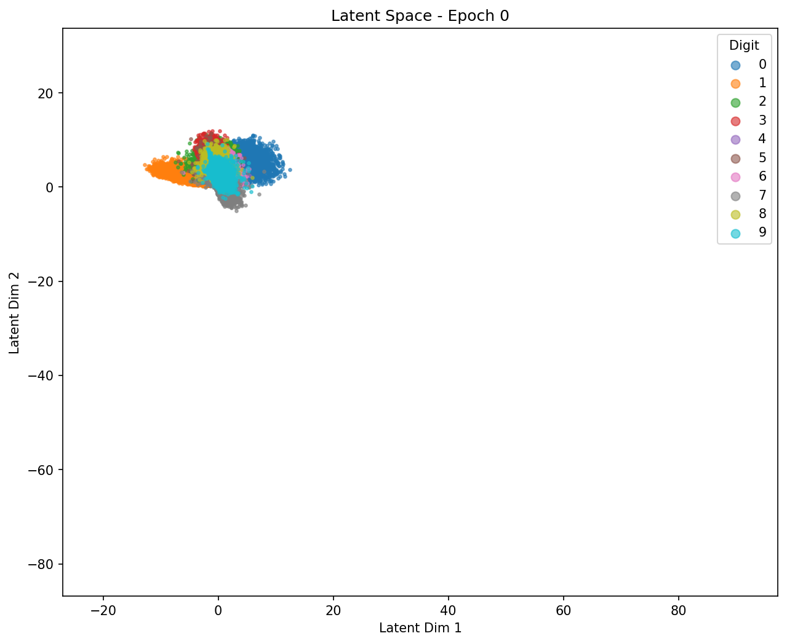
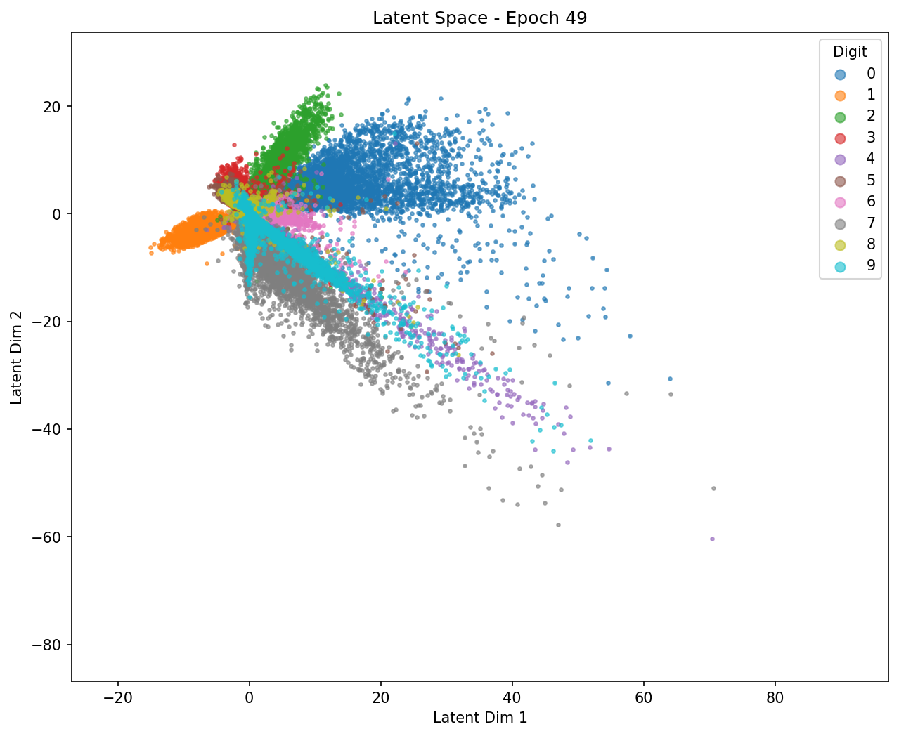

# MNIST Autoencoder

A PyTorch implementation of an autoencoder for MNIST digit reconstruction with 2D latent space visualization.

## Project Structure

- `model.py` - Autoencoder architecture (encoder → latent → decoder)
- `train.py` - Training script with CLI arguments and checkpointing
- `evaluate.py` - Validation logic
- `dataset.py` - MNIST data loading using HuggingFace datasets
- `config.toml` - Model and training configuration
- `notebooks/` - Analysis and visualization notebooks

## Installation

```bash
uv sync
```

## Usage

Train the model:
```bash
python train.py
python train.py --epochs 50 --batch-size 128
python train.py --checkpoint checkpoints/last.pt  # resume training
```

## Model Architecture

- **Input**: 784 (28x28 flattened MNIST images)
- **Encoder**: 784 → 256 → 32 (with BatchNorm + ReLU)
- **Latent**: 2 dimensions (for visualization)
- **Decoder**: 2 → 32 → 256 → 784 (with Sigmoid output)

## Configuration

Edit `config.toml` to modify:
- `d_hidden` - Hidden layer size
- `d_latent` - Latent space dimensions
- `num_epochs` - Training epochs
- `batch_size` - Batch size

## Latent Space Analysis

The notebook `notebooks/analyze_latent_space.ipynb` contains a detailed study of how the autoencoder learns to organize digits in 2D latent space.

### Training with Latent Tracking

We train the autoencoder with a **2-dimensional latent space** (instead of the typical higher dimensions) specifically to enable visualization. During training, we record the latent representations of all 60,000 training samples at each epoch, storing both the 2D coordinates and their corresponding digit labels.

### Latent Space Evolution

| Epoch 0 | Epoch 49 | Epoch 99 |
|---------|----------|----------|
|  |  |  |

**Key observations:**
- **Epoch 0**: Points are randomly scattered with no clear structure
- **Mid-training**: Digit classes begin forming distinct clusters
- **Epoch 99**: Clear separation between most digit classes, though some overlap remains (e.g., 4/9, 3/5/8)

### Sampling from Latent Space

By sampling random points from the latent space and decoding them, we can explore what the model has learned:

**Separated regions**: Sampling from well-separated clusters (e.g., where "1"s cluster) produces clear, recognizable digits.

**Overlapping regions**: Sampling from areas where multiple digit classes overlap produces ambiguous or hybrid images - blends of multiple digits that reveal the model's uncertainty in those regions.

This demonstrates that the autoencoder learns a meaningful continuous representation where similar digits are placed nearby, and interpolating between clusters produces smooth transitions between digit styles.
